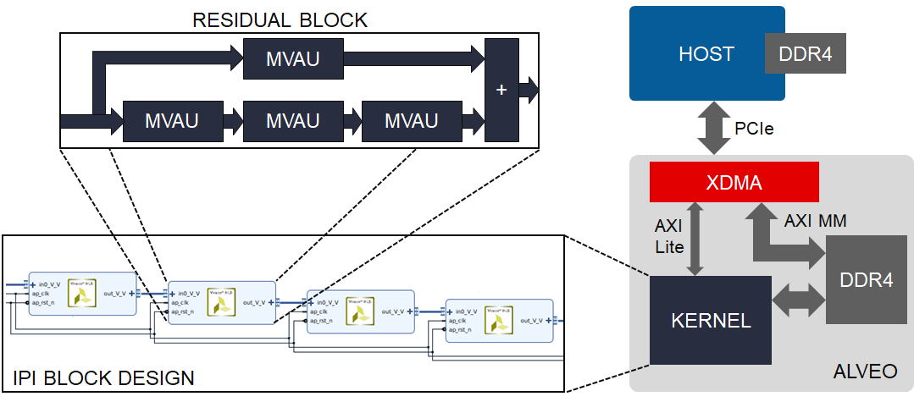

We're pleased to announce as part of the FINN project our release of the first fully quantized, all-dataflow ResNet50 inference accelerator for Xilinx Alveo boards. The source code is available on [GitHub](https://github.com/Xilinx/ResNet50-PYNQ) and we provide a Python [package](https://pypi.org/project/resnet50-pynq/) and Jupyter Notebook to get you started and show how the accelerator is controlled using [PYNQ](http://www.pynq.io/) for Alveo.
Built using a custom [FINN](https://xilinx.github.io/finn/about.html) streamlining flow, which is not yet public, 
this accelerator showcases the advantage of deep quantization for FPGA acceleration of DNN workloads in the datacenter. 
The key performance metrics are:

FPGA Device | ImageNet Accuracy     | Max FPS    | Min Latency | Power @ Max FPS | Power @ Min Latency
----------  |----------             |----------  |----------   |----------       |----------
Alveo U250  | 65% Top-1 / 85% Top-5 | 2000       | 2 ms      | 70 W            | 40 W

In addition to demonstrating the achievable performance of low-precision dataflow acceleration on Alveo, the ResNet50 design
serves as proof of concept for two key features of future FINN releases: 
modular build flows based on Vivado IP Integrator, and pure Python interface to the accelerator. 

## Modular build flow

FINN accelerators targetting embedded parts, such as the [BNN-PYNQ](https://github.com/Xilinx/BNN-PYNQ) accelerators, have in the past implemented the
entire acceleration functionality in a singe monolithic HLS C++ description.
For large datacenter-class designs this approach is not feasible, as the HLS simulation and synthesis times become very large.

Instead, here we identify the key computational pattern, the residual block, which we implement as a HLS C++ IP block by assembling multiple Matrix-Vector-Activation Units from the [FINN HLS Library](https://github.com/Xilinx/finn-hlslib). 
We then construct the accelerator by instantiating and connecting multiple residual blocks together in a Vivado IPI block design, which are then synthesized in parallel and exported as a netlist IP.



In our flow, this IP is linked by Vitis into an Alveo platform, but users are free to integrate the ResNet50 IP in their own Vivado-based flows and augment it with other HLS or RTL IP. See our build scripts and documentation for more information.

## Pure Python host interface

Using PYNQ for Alveo, users can interface directly with the ResNet50 accelerator in Python.
To program the accelerator, an Overlay object is created from an XCLBin file produced by Vitis.

```Python
import pynq

ol=pynq.Overlay("resnet50.xclbin")
accelerator=ol.resnet50_1
```

Before using the accelerator, we must configure the weights of the fully-connected layer in DDR Bank 0.
Assuming the weights are already loaded in the NumPy array `fcweights`, we allocate a buffer 
of appropriate size, copy the weights into it, and flush it to the Alveo DDR Bank 0.

```Python
fcbuf = pynq.allocate((1000,2048), dtype=np.int8, target=ol.bank0)
fcbuf[:] = fcweights
fcbuf.sync_to_device()
```

To perform inference we first allocate input and output buffers for one image, and copy the contents of the NumPy array `img` into the input buffer.
We then flush the input data to the Alveo DDR Bank 0, and call the accelerator providing as arguments
the input and output buffers, the FC layer weights buffer, and the number of images to process, in this case just one.
After the call finishes, we pull the output buffer data from the accelerator DDR to host memory and copy its 
contents to user memory in a NumPy array.

```Python
inbuf = pynq.allocate((224,224,3), dtype=np.int8, target=ol.bank0)
outbuf = pynq.allocate((5,), dtype=np.uint32, target=ol.bank0)

inbuf[:] = img
inbuf.sync_to_device()

accelerator.call(inbuf, outbuf, fcbuf, 1)

outbuf.sync_from_device()
results = np.copy(outbuf)
```

It's that easy! See our Jupyter Notebook demo and application examples for more details.
