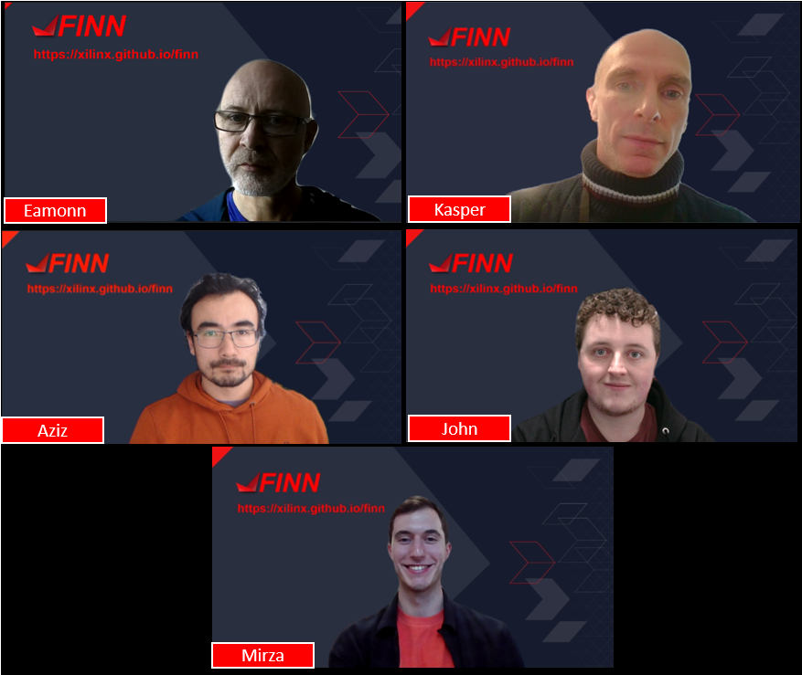

# Who are we?

The FINN team consists of members of AMD Research under Ralph Wittig (AMD Research & Advanced Development) and members of Custom & Strategic Engineering under Allen Chen, working very closely with the Pynq team.

From top left to bottom right: Yaman Umuroglu, Michaela Blott, Thomas Preusser,
Jakoba Petri-Koenig, Lucian Petrica, Nicholas Fraser,
Linus Witschen, Ken O’Brien, Tobias Alonso Pugliese, Petra Hrg

From top left to bottom right: Eamonn Dunbar, Kasper Feurer, Aziz Bahri, John Monks, Mirza Mrahorovic

