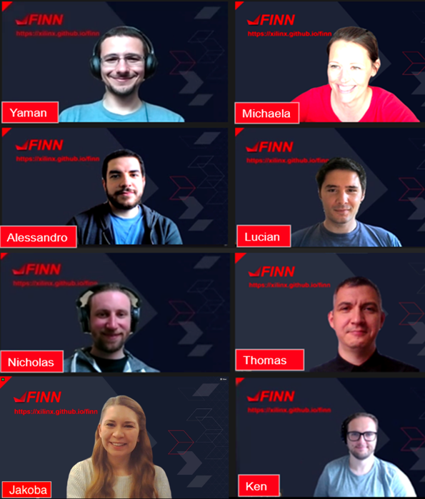

## Who are we?

The FINN team consists of members of AMD Research under Ralph Wittig (AMD Research & Advanced Development) and members of Custom & Strategic Engineering under Allen Chen, working very closely with the Pynq team.

From top left to bottom right: Yaman Umuroglu, Michaela Blott, Alessandro Pappalardo, Lucian Petrica, Nicholas Fraser,
Thomas Preusser, Jakoba Petri-Koenig, Ken O’Brien

From top left to bottom right: Eamonn Dunbar, Kasper Feurer, Aziz Bahri, John Monks, Mirza Mrahorovic

