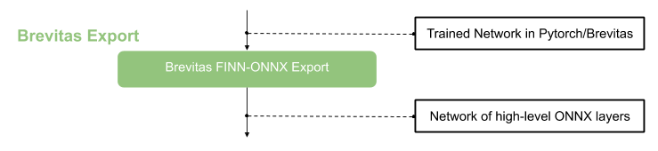

.. _brevitas_export:

***************
Brevitas Export
***************

FINN expects an ONNX model as input. This can be a model trained with `Brevitas <https://github.com/Xilinx/brevitas>`_. Brevitas is a PyTorch library for quantization-aware training and the FINN Docker image comes with several `example Brevitas networks <https://github.com/Xilinx/brevitas/tree/master/src/brevitas_examples/bnn_pynq>`_. Brevitas provides an export of a quantized network in ONNX representation in several flavors.
Two of the Brevitas-exported ONNX variants can be ingested by FINN:

   * FINN-ONNX: Quantized weights exported as tensors with additional attributes to mark low-precision datatypes. Quantized activations exported as MultiThreshold nodes.
   * QONNX: All quantization is represented using Quant, BinaryQuant or Trunc nodes. QONNX must be converted into FINN-ONNX by :py:mod:`finn.transformation.qonnx.convert_qonnx_to_finn`

To work with either type of ONNX model, it is loaded into a :ref:`modelwrapper` provided by FINN.

At this stage we can already use the functional verification flow to simulate the model using Python. For more details please have look at :ref:`verification`.

The model can now be further processed in FINN, the next flow step is :ref:`nw_prep`.
