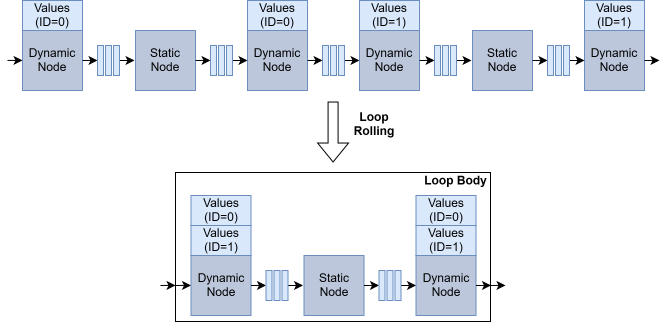
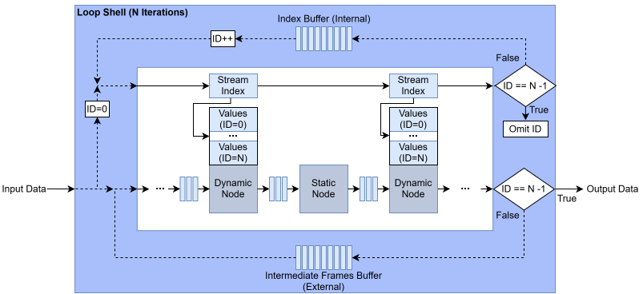
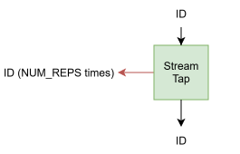
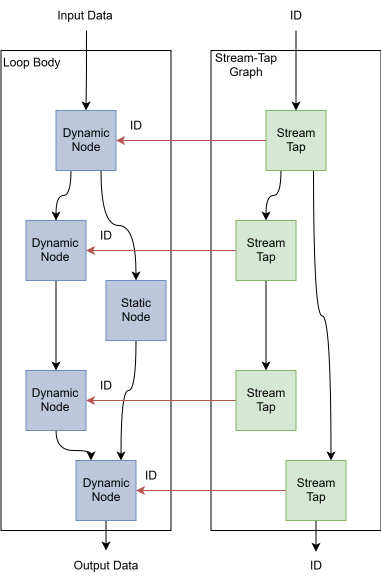
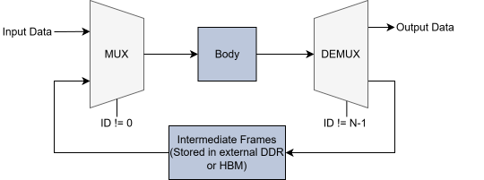
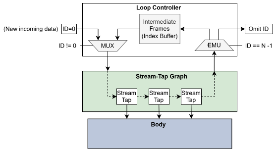
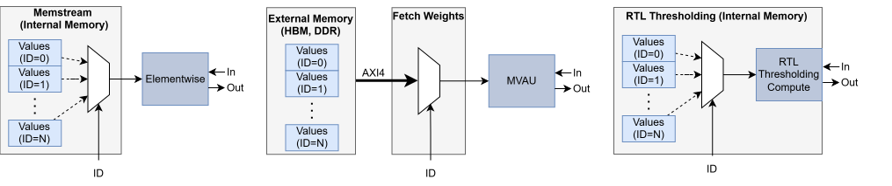
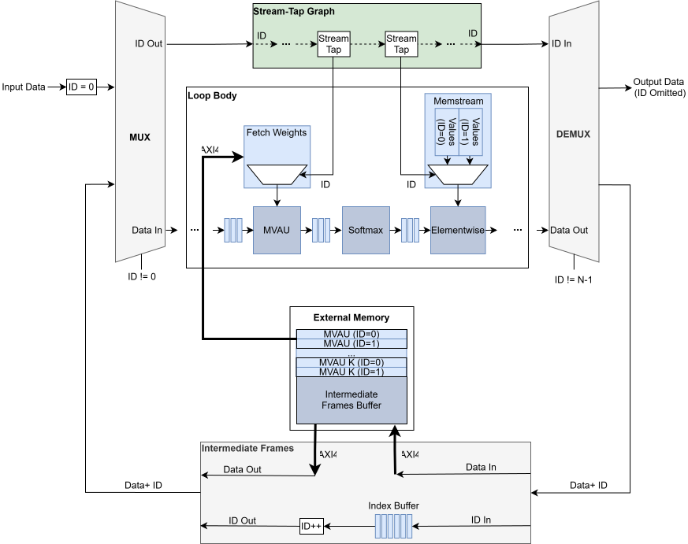

***************************************
Multi-Layer Offload (MLO)
***************************************

The FINN compiler dedicates hardware resources to each stage of a computation
graph to achieve high throughput and low latency through pipelining. Every layer
runs concurrently on its own compute resources and has its own parameters either on-chip or off-chip.
However, this approach does not scale to modern, large neural networks such as
Transformers, because the hardware resource requirements grow with depth.

Many modern workloads contain repeated computational blocks that share the same
structure but differ only in their parameters (for example a stack of identical
Transformer encoder blocks). Multi-Layer Offload (MLO) exploits this property to
collapse the repeated subgraphs, through so-called loop rolling, into a single looped subgraph, the loop body.
Within the loop body, nodes fall into two categories. **Dynamic nodes** are
parameter-holding nodes whose parameters differ between iterations. Their
parameter set has to be switched on every iteration, while their hardware remains the same.
**Static nodes** stay the same across all iterations and therefore reuse the exact same hardware and parameters
on every pass. The loop body is implemented in hardware only once, wrapped by a shell
that selects the right parameters and feeds intermediate data to the body on every iteration.
MLO introduces a trade-off between throughput and resource footprint.
In some cases, a neural network cannot be implemented without MLO.

|

|

MLO Build flow
===================

TODO

Hardware
========

FINNLoop
--------

The ``FINNLoop`` is the ``HWCustomOp`` that represents an MLO region in the FINN-ONNX graph.
It is a container node, instead of describing a single operator, it wraps
an entire set of nodes, which is then executed for N iterations.

Conceptually, the ``FINNLoop`` is a single physical copy of the body with two
streams in parallel, circulating around it, one iteration at a time. A data path carries
the actual data, and an index path carries a stream index (ID) that
selects which parameters the body uses on each iteration.

|

On the data path, the input data is processed by the body on the first
iteration, and its output becomes the input of the next iteration. After the final
iteration the result leaves as the loop output. Between iterations the data
is buffered so it can be replayed into the body. This buffering is implemented via external memory access.
For this, either DDR memory or HBM is supported.

On the index path, the stream index is essentially the iteration (or layer)
counter, starting with the value 0. Parameter-holding operators are instantiated only
once in hardware, but logically stand in for many different operators (one per
iteration). The index tells each of them which parameter set to use, so the same
compute hardware is able to realize a different layer on every pass. The index also signals
when the last iteration has been reached and the result should be emitted.
The index is held in an on-chip FIFO that keeps it in lockstep with the
data path, so the parameters selected on each pass stay synchronized with the
frame currently flowing through the body.

In hardware this behavior is realized by multiple blocks, described in
the following sections. The loop controller, which acts as the loop shell
around the body to recirculate the data and index, the stream-tap graph, which distributes the index to every parameter-holding operator
and the per operator parameter streaming, which turns an index into the actual parameters.

Loop Controller
---------------------

The loop controller (``loop_control``, ``finn-rtllib/mlo/loop_control.sv``) is
the loop shell around the body. It manages both the data path and the index path, and
contains three sub-blocks:

* the **mux** on the input side, which chooses what data stream is fed into the body on
  each iteration. Either the fresh external input (on the first iteration) or the
  frames recirculated from the previous iteration. It also emits the index
  that travels alongside the data.
* the **demux** on the output side, which inspects the returning index to
  decide where the body's output should go. Back into the buffer for another
  iteration, or out of the loop when the last iteration has completed.
* the **intermediate frames** engine, a DMA-backed buffer in external memory
  that stores each iteration's body output and replays it as the next iteration's input, while carrying
  the index alongside in internal memory and advancing it for the next iteration.

Stream-Tap Graph
-----------------------

The stream-tap graph reconstructs the parameter connectivity of the body as an
AXI4-Stream network, driven by the index. The stream-tap graph consists of output stream-tap
components.

The stream-tap component is a three-port element that:

* forwards the incoming index stream to the next tap
* taps a copy of the index out to its own parameter operator, repeating each value **TAP_REP** times.

**TAP_REP** accounts for how often an operator consumes the index relative to how
often it changes.

The taps are wired together according to the parameter connectivity of the body,
which is derived as an adjacency list over the parameter-holding operators (plus the
body inputs and outputs). Most connections are point-to-point, one tap's output feeds
the next tap's input. Two special cases arise from the topology, forks and joins.

A fork occurs when a single source drives more than one tap, i.e. the same index
stream has to reach several parameter operators. There are two implementations:

* When the fork originates at the body input, an ``axis_broadcaster`` IP is
  instantiated. Its single slave stream is fanned out to one master stream per
  destination tap, with full AXI4-Stream handshaking.
* When the fork originates at an internal tap, the data (``TDATA``) is fanned out
  directly to every destination, and the AXI4-Stream handshake is rebuilt from discrete logic.
  A cascade of AND gates combines the source ``TVALID`` with every destination
  ``TREADY``, so a transfer only fires once the source is valid and all destinations
  are ready. The combined signal drives the source ``TREADY`` and every destination
  ``TVALID``.

A join occurs when a tap is reachable from more than one source. Since a tap only
needs a single index stream, joins are not built in hardware. Instead the adjacency
list is pruned so that each tap keeps exactly one feeding edge.

Regardless of its internal topology, the stream-tap graph ingests and outputs the
same index stream. It distributes copies to the parameter operators along the way,
but passes the index through unchanged.

|

Data path
---------------

The data path describes the path the data takes inside the ``FINNLoop``.

#. The external input enters the controller.
#. The mux chooses the body's input between the fresh external input and the recirculated
   frame coming back from the intermediate frames buffer.
#. The body computes one layer and emits the data to the demux.
#. The demux routes that output either back to the intermediate frames buffer if more iterations remain, or out on the final iteration.
#. ``intermediate_frames`` is the recirculation store, a circular buffer in external memory (DDR/HBM),
   accessed over an AXI4 master. Each slot holds one full feature-map frame.
   It writes the body output, then reads it back to feed the mux on the next iteration.

|

Index path
---------------

The index is the per-iteration layer counter. It rides in a ring parallel to the data path, where it selects the current layer's
parameters, tells the demux when to stop, and increments for the next iteration.

#. The mux emits index ``ID = 0`` for a fresh external input, or the index returned by the
   frame buffer for recirculated data. It leaves the controller together with the outgoing data.
#. The stream-tap graph forwards the index to every parameter node
   and passes it through, unchanged, to its output.
#. The index returns to the demux. If ``ID == N_ITERATIONS - 1`` the demux routes the data to the output.
   Otherwise it forwards both the data and the index to the intermediate frames buffer.
#. ``intermediate_frames`` emits ``ID = ID + 1`` back to the mux.

|

|

Parameter streaming
------------------------

The stream-tap delivers the index to the parameter-holding operators.
There are three different approaches to turning this index into actual parameters.

These are the supported parameter-holding operators with their respective parameter streaming:

.. list-table::
   :header-rows: 1
   :widths: 30 25 25 20

   * - Parameter-holding operator
     - Backend
     - Parameter streaming
     - Memory
   * - **MVAU**
     - RTL
     - Fetch Weights
     - external
   * - **Elementwise**
     - RTL and HLS
     - Memstream
     - internal
   * - **Thresholding**
     - RTL
     - Native
     - internal

All of the different parameter-holding operators follow a similar idea. They receive the index as an
AXI4-Stream, which triggers some component to stream the parameters to some compute unit.
The stream-tap emits the index as many times as needed to compute a single frame (specified by **TAP_REP**).

The three approaches differ in where the parameters live and how the index selects them:

* **Fetch Weights:** the index looks up a per-layer base address, which drives
  a DMA read from external memory. The weights are double-buffered on-chip before reaching
  the compute core. The Fetch Weights unit keeps parameters off-chip.
* **Memstream:** all parameter sets sit consecutively in on-chip memory.
  The index sets the read pointer to the start of its section, which is then streamed out.
* **Native (RTL Thresholding):** all threshold sets are stored inside the thresholding
  core itself. The index rides as a sideband field with each activation and selects the
  correct threshold row directly.

Address offset
--------------------

If MLO for DDR is enabled, FINN generates an additional block to introduce
base address offsets to the intermediate frames buffer and the Fetch Weights components.
This is required, because all the hardware components access the memory from a single contiguous region.
For HBM MLO, the different components are always reading from memory address 0.

The final external memory address of a component is built from two offsets:

* a compile-time offset, known when the bitstream is generated. FINN lays out all
  components into one contiguous region and assigns each its own base offset within
  that region, so parameters and intermediate frames never overlap
* a runtime offset, the physical address of the memory region, which is only known
  once the driver allocates the buffer at startup. It is programmed into the hardware
  through an AXI4-lite register and added to every access.

For HBM the runtime base and compile-time offset are both zero, so only the
index-scaled stride remains.

Complete Hardware System
------------------------

Putting all of the blocks together yields the complete MLO system. The loop
controller wraps the body and recirculates the data and index. The
stream-tap graph fans the index out to every parameter-holding operator and the
per operator parameter streaming turns each index into the actual parameters. The
data is buffered through the intermediate frames engine in external
memory, while the index ring stays in lockstep with the activations so the right
parameters are selected on every pass.

The figure below shows how these components connect in a single ``FINNLoop``
instance, from the external input entering the controller, through the body and
the stream-tap graph, to the final result leaving on the last iteration. The figure shows
a configuration with **N_ITERATIONS** of 2. This means every parameter-holding operator has two
different parameter sets.

|

.. note::
   For clarity, the diagram depicts the starting-ID generation as occurring
   outside the MUX. In the actual implementation, however, it takes place inside
   the MUX.

See Also
========

- :ref:`rtl_swg` - RTL ConvolutionInputGenerator component
- `finn-rtllib MLO <https://github.com/Xilinx/finn-rtllib/tree/main/mlo>`_ - RTL implementation source code
