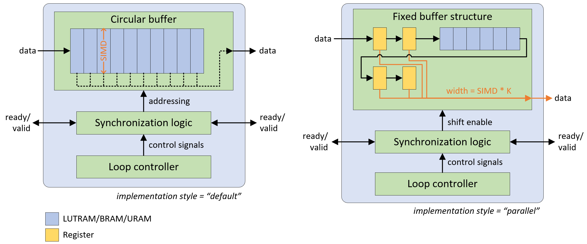

.. _rtl_swg:

***************************************
RTL ConvolutionInputGenerator
***************************************

FINN implements convolution operations by pairing a ConvolutionInputGenerator (or "sliding window generator (SWG)") with an MVAU or VVAU (for depthwise convolution).

The RTL ConvolutionInputGenerator is the current implementation, replacing the deprecated HLS version. It offers the following improvements:

* Support for a wider range of hyperparameters without fragmentation into multiple HLS functions
* Additional degrees of parallelism (i.e., across the output window or multiple input samples) that are difficult to implement in HLS
* Additional features, such as dynamic feature map sizing
* Improved resource efficiency

.. note:: The HLS ConvolutionInputGenerator (from `finn-hlslib <https://github.com/Xilinx/finn-hlslib/blob/master/slidingwindow.h>`_) is deprecated. Use the RTL version instead.

The component is implemented by generating (System-)Verilog code for each individual instance, realized via the template + replacement dictionary mechanism found in other FINN components.

Implementation Styles
=====================

Depending on the amount of parallelism requested, one of two implementation styles is selected. The following table defines folding parameters (marked in bold text) and supported configurations.

.. list-table:: Parallelism configurations
   :header-rows: 1
   :widths: 10 20 10 15 15 15 15

   * - **SIMD**
     - **parallel_window**
     - **M**
     - MMV_in
     - MMV_out
     - Style
     - Notes
   * - < C
     - 0
     - 1
     - 1
     - 1
     - default
     - depthwise-aware
   * - C
     - 0
     - 1
     - 1
     - 1
     - default
     - depthwise-agnostic
   * - < C
     - 1
     - 1
     - 1
     - K
     - parallel
     - depthwise only
   * - C
     - 1
     - 1
     - 1
     - K
     - parallel
     - depthwise-agnostic
   * - C
     - 1
     - M
     - M
     - M*K
     - parallel
     - Currently unsupported

**Legend:**

- **C** = Number of channels
- **MMV_in** = Input samples (or "pixels") per cycle
- **MMV_out** = Output samples (or "pixels") per cycle
- **K** = kernel_width * kernel_height

The following diagram shows the operating principle of both styles, the "parallel" variant is pictured for a 2x2 kernel without dilation.

Architecture Differences
------------------------

**Default style:**
    Uses an addressable circular buffer, which can be implemented in LUTRAM, BRAM, or URAM resources. The output width equals the input width.

**Parallel style:**
    Uses a fixed structure of registers and line buffers to enable parallel access to multiple window elements. This avoids memory port limitations and exploding multiplexing logic, while still featuring LUT-saving BRAM/URAM implementation for the line buffers.

Dynamic Mode
------------

The "default" style also supports a dynamic mode, which provides an interface to change feature map dimensions, stride, or dilation at run-time. See `this pull request <https://github.com/Xilinx/finn/pull/688>`_ for more information.

Folding
=======

The RTL SWG is supported by the basic automatic folding algorithm in FINN (:py:mod:`finn.transformation.fpgadataflow.set_folding.SetFolding`). Consider the following implications:

MVAU Pairing
------------

Although it is recommended to unfold SIMD first, SIMD and PE can be set independently. Full (and balanced) parallelism is achieved by using the SWG in parallel window mode and setting MVAU SIMD and PE to their maximum values:

- **SIMD** = MW = C_in * K
- **PE** = MH = C_out

VVAU Pairing
------------

The VVAU component supports SIMD unfolding (up to SIMD = K) independently from PE unfolding (up to PE = C), but cannot accept a datawidth-converted input from a fully-parallel SWG when PE is not fully unfolded due to the depthwise data layout.

**Constraint:** When window-parallelism is enabled, SIMD of the SWG must equal PE of the VVAU:

- **ConvolutionInputGenerator_rtl.SIMD** = **VVAU.PE**

In this scenario, VVAU SIMD < K is supported via an automatically inserted DWC.

See Also
========

- :ref:`folding_factors` - Folding factor constraints for all layers
- `finn-rtllib SWG <https://github.com/Xilinx/finn-rtllib/tree/main/swg_template>`_ - RTL implementation source code
