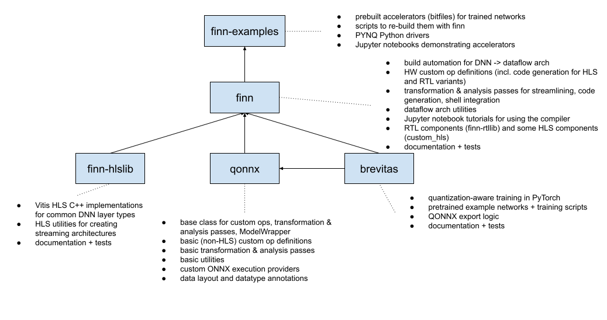

***********************
Developer documentation
***********************

.. note:: **This page is under construction.**

This page is intended to serve as a starting point for new FINN developers.
Power users may also find this information useful.

Prerequisites
================

Before starting to do development on FINN it's a good idea to start
with understanding the basics as a user. Going through all of the
:ref:`tutorials` is strongly recommended if you haven't already done so.
Additionally, please review the documentation available on :ref:`internals`.

Repository structure
=====================

The figure above gives a description of the repositories used by the
FINN project, and how they are interrelated.

Branching model
===============

All of the FINN repositories mentioned above use a variant of the
GitHub flow from https://guides.github.com/introduction/flow as
further detailed below:

* The `master` or `main` branch contains the latest released
  version, with a version tag.

* The `dev` branch is where new feature branches get merged after
  testing. `dev` is "almost ready to release" at any time, and is
  tested with nightly Jenkins builds -- including all unit tests
  and end-to-end tests.

* New features or fixes are developed in branches that split from
  `dev` and are named similar to `feature/name_of_feature`.
  Single-commit fixes may be made without feature branches.

* New features must come with unit tests and docstrings. If
  applicable, it must also be tested as part of an end-to-end flow,
  preferably with a new standalone test. Make sure the existing
  test suite (including end-to-end tests) still pass.
  When in doubt, consult with the FINN maintainers.

* When a new feature is ready, a pull request (PR) can be opened
  targeting the `dev` branch, with a brief description of what the
  PR changes or introduces.

* Larger features must be broken down into several, smaller PRs. If
  your PRs have dependencies on each other please state in which order
  they should be reviewed and merged.

Docker images
===============

If you want to add new dependencies (packages, repos) to FINN it's
important to understand how we handle this in Docker.

The finn.dev image is built and launched as follows:

1. run-docker.sh launches fetch-repos.sh to checkout dependency git repos at correct commit hashes (unless ``FINN_SKIP_DEP_REPOS=1``)

2. run-docker.sh launches the build of the Docker image with `docker build` (unless ``FINN_DOCKER_PREBUILT=1``). Docker image is built from docker/Dockerfile.finn using the following steps:

  * Base: PyTorch dev image
  * Set up apt dependencies: apt-get install a few packages for verilator and
  * Set up pip dependencies: Python packages FINN depends on are listed in requirements.txt, which is copied into the container and pip-installed. Some additional packages (such as Jupyter and Netron) are also installed.
  * Install XRT deps, if needed: For Vitis builds we need to install the extra dependencies for XRT. This is only triggered if the image is built with the INSTALL_XRT_DEPS=1 argument.

3. Docker image is ready, run-docker.sh can now launch a container from this image with `docker run`. It sets up certain environment variables and volume mounts:

  * Vivado/Vitis is mounted from the host into the container (on the same path).
  * The finn root folder is mounted into the container (on the same path). This allows modifying the source code on the host and testing inside the container.
  * The build folder is mounted under /tmp/finn_dev_username (can be overridden by defining FINN_HOST_BUILD_DIR). This will be used for generated files. Mounting on the host allows easy examination of the generated files, and keeping the generated files after the container exits.
  * Various environment variables are set up for use inside the container. See the run-docker.sh script for a complete list.

4. Entrypoint script (docker/finn_entrypoint.sh) upon launching container performs the following:

  * Source Vivado settings64.sh from specified path to make vivado and vivado_hls available.
  * Download PYNQ board files into the finn root directory, unless they already exist.
  * Source Vitits settings64.sh if Vitis is mounted.

5. Depending on the arguments to run-docker.sh a different application is launched. run-docker.sh notebook launches a Jupyter server for the tutorials, whereas run-docker.sh build_custom and run-docker.sh build_dataflow trigger a dataflow build (see documentation). Running without arguments yields an interactive shell. See run-docker.sh for other options.

(Re-)launching builds outside of Docker
========================================

It is possible to launch builds for FINN-generated HLS IP and stitched-IP folders outside of the Docker container.
This may be necessary for visual inspection of the generated designs inside the Vivado GUI, if you run into licensing
issues during synthesis, or other environmental problems.
Simply set the ``FINN_ROOT`` environment variable to the location where the FINN compiler is installed on the host
computer, and you should be able to launch the various .tcl scripts or .xpr project files without using the FINN
Docker container as well.

Linting
=======

We use a pre-commit hook to auto-format Python code and check for issues.
See https://pre-commit.com/ for installation. Once you have pre-commit, you can install
the hooks into your local clone of the FINN repo.
It's recommended to do this **on the host** and not inside the Docker container:

::

  pre-commit install

Every time you commit some code, the pre-commit hooks will first run, performing various
checks and fixes. In some cases pre-commit won't be able to fix the issues and
you may have to fix it manually, then run `git commit` once again.
The checks are configured in .pre-commit-config.yaml under the repo root.

Testing
=======

Tests are vital to keep FINN running.  All the FINN tests can be found at https://github.com/Xilinx/finn/tree/main/tests.
These tests can be roughly grouped into three categories:

 * Unit tests: targeting unit functionality, e.g. a single transformation. Example: https://github.com/Xilinx/finn/blob/main/tests/transformation/streamline/test_sign_to_thres.py tests the expected behavior of the `ConvertSignToThres` transformation pass.

 * Small-scale integration tests: targeting a group of related classes or functions that to test how they behave together. Example: https://github.com/Xilinx/finn/blob/main/tests/fpgadataflow/test_convert_to_hls_conv_layer.py sets up variants of ONNX Conv nodes that are first lowered and then converted to FINN HLS layers.

 * End-to-end tests: testing a typical 'end-to-end' compilation flow in FINN, where one end is a trained QNN and the other end is a hardware implementation. These tests can be quite large and are typically broken into several steps that depend on prior ones. Examples: https://github.com/Xilinx/finn/tree/main/tests/end2end

Additionally, qonnx, brevitas and finn-hlslib also include their own test suites.
The full FINN compiler test suite
(which will take several hours to run and require a PYNQ board) can be executed
by:

::

  bash ./run-docker.sh test

There is a quicker variant of the test suite that skips the tests marked as
requiring Vivado or as slow-running tests:

::

  bash ./run-docker.sh quicktest

When developing a new feature it's useful to be able to run just a single test,
or a group of tests that e.g. share the same prefix.
You can do this inside the Docker container
from the FINN root directory as follows:

::

  pytest -k test_brevitas_debug --pdb

If you want to run tests in parallel (e.g. to take advantage of a multi-core CPU)
you can use:

* pytest-parallel for any rtlsim tests, e.g. `python setup.py test --addopts "-k rtlsim --workers auto"`
* pytest-xdist for anything else, make sure to add `--dist=loadfile` if you have tests in the same file that have dependencies on each other e.g. `python setup.py test --addopts "-k mytest -n auto --dist=loadfile"`

Finally, the full test suite with appropriate parallelization can be run inside the container by:

::

  quicktest.sh full

See more options on pytest at https://docs.pytest.org/en/stable/usage.html.

Documentation
==============

FINN provides two types of documentation:

* manually written documentation, like this page
* autogenerated API docs from Sphinx

Everything is built using Sphinx, which is installed into the finn.dev
Docker image. You can build the documentation locally by running the following
inside the container:

::

  python setup.py docs

You can view the generated documentation on build/html/index.html.
The documentation is also built online by readthedocs:

  * finn.readthedocs.io contains the docs from the master branch
  * finn-dev.readthedocs.io contains the docs from the dev branch

When adding new features, please add docstrings to new functions and classes
(at least the top-level ones intended to be called by power users or other devs).
We recommend reading the Google Python guide on docstrings here for contributors:
https://google.github.io/styleguide/pyguide.html#38-comments-and-docstrings
