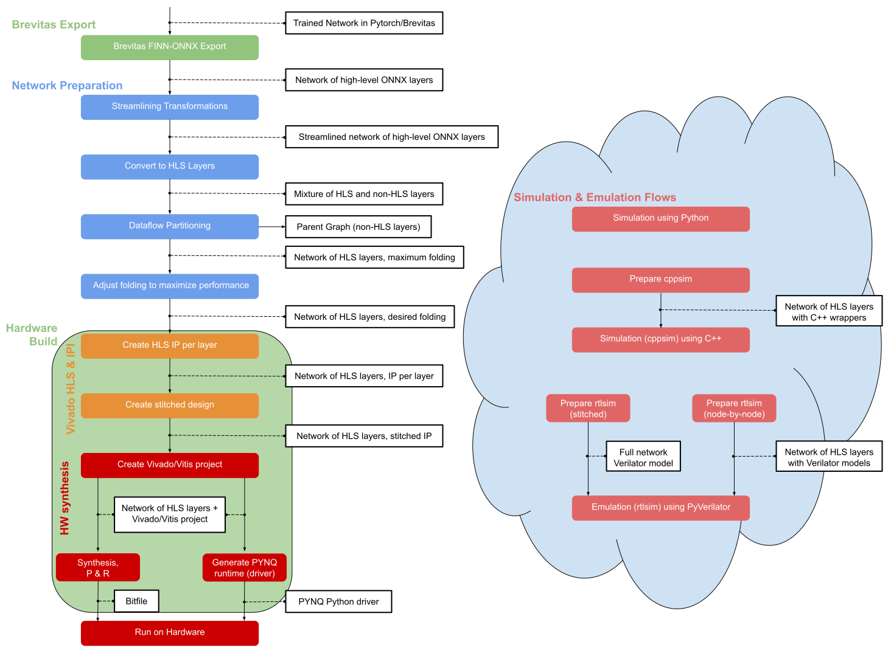

***************
End-to-End Flow
***************

The following image shows the end-to-end flow of FINN. As you can see in the picture, FINN has a high modularity and has the property that the flow can be stopped at any point and the intermediate result can be used for further processing or other purposes. This enables a wide range of users to benefit from FINN, even if they do not use the whole flow.

Flow structure
==============

The cylinder-like fields show the state of the network representation in the respective step. The rectangular fields represent the transformations that are applied to the network to achieve a certain result. The diagram is divided into five blocks, each of it includes several flow steps. The flow starts in top left corner with Brevitas export (pink block), followed by the preparation of the network (grey block) for the Vivado HLS and Vivado IPI (yellow block). There is also a section for testing and verification in software (green block) and the hardware generation and deployment on the PYNQ board (red block). 

For more details about the different flow sections, please have a look at the corresponding pages on this website.

* :ref:`brevitas_export`

* :ref:`nw_prep`

* :ref:`vivado_synth`

* :ref:`pynq_deploy`

* :ref:`verification`

