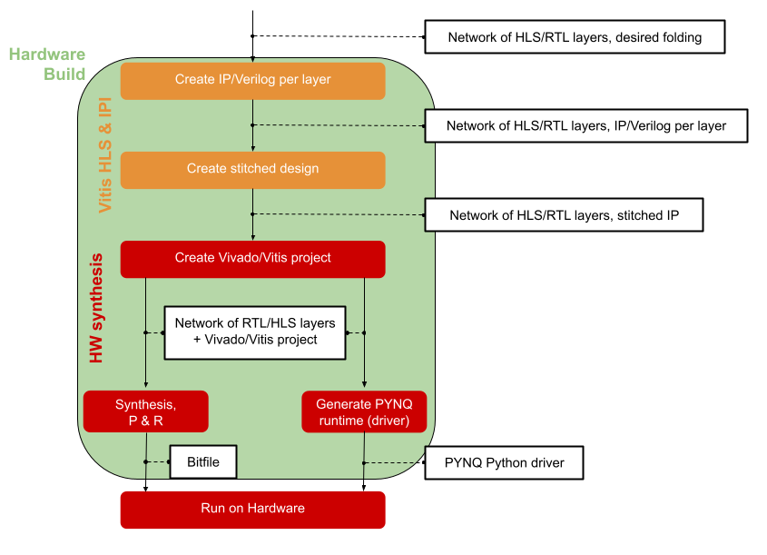

.. _hw_build:

*****************************
Hardware Build and Deployment
*****************************

A model where all layers have been converted to HLS layers can be processed by
FINN to build a bitfile and driver targeting a Zynq system or to generate a Vivado IP Integrator (IPI)
design with AXI stream (FIFO) in-out interfaces, which can be integrated onto any Xilinx FPGA as part of a larger system.

.. warning::
    With the new FINN release, we do not offer out-of-the box support for Alveo cards anymore.
    Please use an older FINN version (v04b - v0.7) and Vitis 2020.1 in case you want to use `VitisBuild`. The description for the `VitisBuild` below is still valid for older versions.

Hardware Build
==============

Internally, the hardware build for Zynq devices consists of the following steps:

1. Driver generation
2. DMA and DWC node insertion
3. Partitioning for floorplanning
4. FIFO insertion and IP generation
5. Vivado/Vitis project generation and synthesis

.. note::
  In previous FINN releases it was necessary to step through the individual sub-steps for hardware build manually by calling each transformation. The hardware build transformations `ZynqBuild` now execute all necessary sub-transformations. For more control over the build process, the transformations listed below can still be called individually.

Driver Generation
------------------

To rapidly test the generated design on PYNQ platforms, FINN is capable of
generating a Python driver for the given design. This driver packs/unpacks the
input/output tensors in the expected format, then uses PYNQ APIs to initiate
data movement and transfer back the results to the host CPU. The generation of
the driver is done by transformation pass :py:mod:`finn.transformation.fpgadataflow.make_pynq_driver.MakePYNQDriver`.

DMA and DWC Node Insertion
---------------------------

At this step, FINN will insert custom hardware-oriented ONNX nodes into the graph.
These are DMA engines for moving data into and out of the accelerator (from DRAM),
and data width converters between consecutive nodes where required.
These steps are accomplished by calling the :py:mod:`finn.transformation.fpgadataflow.insert_iodma.InsertIODMA`
and :py:mod:`finn.transformation.fpgadataflow.insert_dwc.InsertDWC` transformations,
respectively.

Partitioning for Floorplanning
-------------------------------

FINN will now partition the graph into several StreamingDataflowPartitions.
This capability is most to facilitate floorplanning for future FINN releases
and does not alter the functioning of the model itself. Each DMA node will be
placed into its own partition. If no partition number attributes are specified,
all the regular network nodes will become a single partition.
This is accomplished by the :py:mod:`finn.transformation.fpgadataflow.floorplan.Floorplan`
and :py:mod:`finn.transformation.fpgadataflow.create_dataflow_partition.CreateDataflowPartition`
transformations.

.. note:: For Vitis, each partition will be compiled as a separate kernel, and linked together afterwards. For Zynq, each partition will become an IP block.

FIFO Insertion and IP Generation
---------------------------------

FINN will descend into each partition and insert FIFO nodes between streaming nodes,
where FIFO depths dictated by the node attributes, using the :py:mod:`finn.transformation.fpgadataflow.insert_fifo.InsertFIFO`
transformation.
Afterwards, IP blocks will be created for each partition, which in turn contain the
IP blocks for each layer stitched together. The layer-level IP blocks
are generated by Vivado HLS, using a sequence of :py:mod:`finn.transformation.fpgadataflow.prepare_ip.PrepareIP`
and :py:mod:`finn.transformation.fpgadataflow.hlssynth_ip.HLSSynthIP` transformations.
The top-level IP blocks are generated in Vivado IPI, using the :py:mod:`finn.transformation.fpgadataflow.create_stitched_ip.CreateStitchedIP` transformation.

Vivado/Vitis Project Generation and Synthesis
---------------------------------------------

The final step in the hardware build flow is to generate a Vivado (for Zynq) or Vitis (for Alveo)
project, and run synthesis to generate a bitfile. This is done using the `MakeZYNQProject`
transformation for Zynq, and the `VitisLink` transformation for Alveo.

Deployment
==========

Deployment and Remote Execution
-------------------------------

The bitfile and the driver file(s) are copied to the PYNQ board and can be executed there using the *onnx_exec* function with the right *exec_mode* settings. For details please have a look at transformation :py:mod:`finn.transformation.fpgadataflow.make_deployment.DeployToPYNQ` and the execution function :py:mod:`finn.core.onnx_exec`.

Throughput Test
---------------

FINN also offers the possibility to measure the network performance directly on the PYNQ board. This can be done by using :py:mod:`finn.core.throughput_test`. When running this function the metrics of the network are returned as dictionary.

