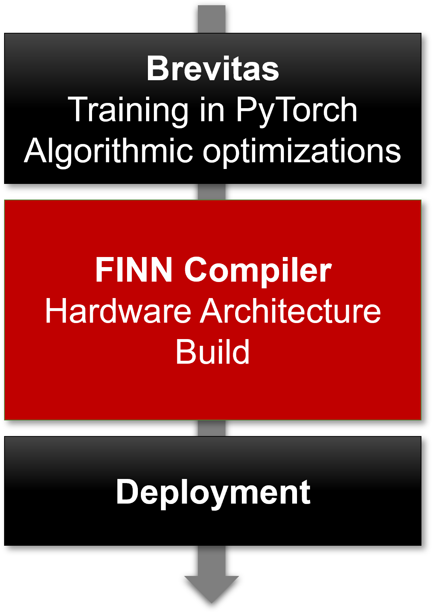

****
FINN
****

Welcome to the FINN Read the Docs website!

What is FINN?
=============

'FINN' is colloquially used to refer to two separate but highly related things:

*  The FINN **project**, which is an experimental framework from Xilinx Research Labs
   to explore deep neural network inference on FPGAs. It specifically targets
   quantized neural networks (QNNs), with emphasis on generating dataflow-style
   architectures customized for each network.
   The key components are illustrated in the figure above;
   including tools for training
   quantized neural networks (Brevitas), the FINN compiler, and the finn-hlslib
   Vivado HLS library of FPGA components for QNNs.
   Read more on the `FINN project homepage <https://xilinx.github.io/finn/>`_.

*  The FINN **compiler**, which this Read the Docs website is the documentation for.
   The compiler is a central part of the FINN project (above) that maps QNNs to
   dataflow-style FPGA architectures.
   You can find the FINN compiler in this `GitHub repository <https://github.com/Xilinx/finn>`_.

More FINN Resources
===================

* `The FINN examples repository <https://github.com/Xilinx/finn-examples>`_

* `List of publications <https://xilinx.github.io/finn/publications>`_

.. toctree::
   :maxdepth: 5
   :hidden:

   getting_started
   tutorials
   end_to_end_flow
   command_line
   example_networks
   internals
   developers
   faq
   source_code/finn
   genindex
