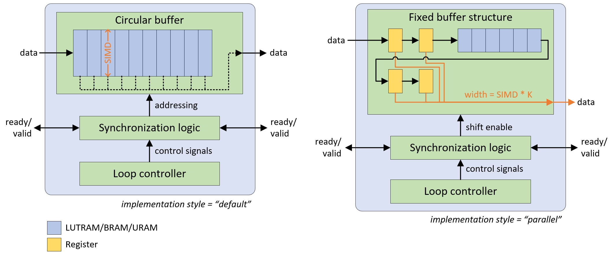

.. _internals:

**********
Internals
**********

Intermediate Representation: QONNX and FINN-ONNX
================================================

FINN uses `ONNX <https://github.com/onnx/onnx>`_ as an intermediate representation (IR) for neural networks. As such, almost every component inside FINN uses ONNX and its `Python API <https://github.com/onnx/onnx/blob/main/docs/PythonAPIOverview.md>`_, so you may want to familiarize yourself with how ONNX represents DNNs. Specifically, the `ONNX protobuf description <https://github.com/onnx/onnx/blob/main/onnx/onnx.proto>`_ (or its `human-readable documentation <https://github.com/onnx/onnx/blob/main/docs/IR.md>`_ and the `operator schemas <https://github.com/onnx/onnx/blob/main/docs/Operators.md>`_ are useful as reference documents. We also provide a Jupyter notebook that can help to get familiar with ONNX by showing how to work with a simple ONNX model in FINN, see chapter :ref:`tutorials` for details.

.. note:: FINN supports two specialized variants of ONNX called QONNX and FINN-ONNX, and not all ONNX graphs are supported by FINN (and vice versa).

Custom Quantization Annotations
===============================

ONNX does not support datatypes smaller than 8-bit integers, whereas in FINN we are interested in smaller integers down to ternary and bipolar. To make this work, FINN-ONNX uses the quantization_annotation field in ONNX to annotate tensors with their FINN DataType (:py:mod:`qonnx.core.datatype.DataType`) information. However, all tensors are expected to use single-precision floating point (float32) storage in FINN. This means we store even a 1-bit value as floating point for the purposes of representation. The FINN compiler flow is responsible for eventually producing a packed representation for the target hardware, where the 1-bit is actually stored as 1-bit.

Note that FINN uses floating point tensors as a carrier data type to represent integers. Floating point arithmetic can introduce rounding errors, e.g. (int_num * float_scale) / float_scale is not always equal to int_num.
When using the custom ONNX execution flow, FINN will attempt to sanitize any rounding errors for integer tensors. See (:py:mod:`qonnx.util.basic.sanitize_quant_values`) for more information.
This behavior can be disabled (not recommended!) by setting the environment variable SANITIZE_QUANT_TENSORS=0.

.. note:: In QONNX the quantization is represented differently, for details please check the `QONNX repository <https://github.com/fastmachinelearning/qonnx>`_ .

Custom Operations/Nodes
=======================

FINN uses many custom operations (op_type in ONNX NodeProto) that are not defined in the ONNX operator schema. These custom nodes are marked with domain="finn.*" or domain="qonnx.*" in the protobuf to identify them as such. These nodes can represent specific operations that we need for low-bit networks, or operations that are specific to a particular hardware backend. To get more familiar with custom operations and how they are created, please take a look in the Jupyter notebook about CustomOps (see chapter :ref:`tutorials` for details) or directly in the module :py:mod:`finn.custom_op`.

Custom ONNX Execution Flow
==========================

To verify correct operation of FINN-ONNX graphs, FINN provides its own ONNX execution flow (:py:mod:`finn.core.onnx_exec`). This flow supports the standard set of ONNX operations as well as the custom FINN operations.

.. warning:: This execution flow is only meant for checking the correctness of models after applying transformations, and not for high performance inference.

.. _modelwrapper:

ModelWrapper
============

FINN provides a ModelWrapper class (:py:mod:`qonnx.core.modelwrapper.ModelWrapper`) as a thin wrapper around ONNX to make it easier to analyze and manipulate ONNX graphs. This wrapper provides many helper functions, while still giving full access to the ONNX protobuf representation.

Some of the helper functions are described in more detail below.

Create a ModelWrapper instance
------------------------------
The ModelWrapper instance can be created using a model in .onnx format or by directly passing a ModelProto instance to the wrapper. The code block below gives an example of how to use the wrapper on a model in .onnx format.
::

  from qonnx.core.modelwrapper import ModelWrapper
  model = ModelWrapper("model.onnx")

Access the ONNX GraphProto through ModelWrapper
-----------------------------------------------
The ONNX ModelProto can be accessed with following command:
::

  modelproto = model.model

The graph can be accessed using:
::

  graphproto = model.graph

The node list is accessed by:
::

  nodes = model.graph.node

The individual nodes can be selected via their indices.
::

  # first node
  nodes[0]

The number of all nodes can be determined with the len() function in Python.
::

  # number of nodes in the graph
  len(nodes)

Helper functions for tensors
----------------------------

A list of all tensors (names) can easily be accessed using:
::

  tensor_list = model.get_all_tensor_names()

If we take a single tensor from that list (by index), we can determine their producer or consumer node by using one of the following functions. Note that it may be that a tensor does not have a producer or consumer node, for example if the tensor represents a constant that is already set. In that case `None` will be returned.
::

  # find producer of third tensor in model tensor list
  model.find_producer(tensor_list[2])

  # find consumer of third tensor in model tensor list
  model.find_consumer(tensor_list[2])

Every tensor has a specific shape, to get or to set this shape these functions can be used:
::

  # get tensor shape of third tensor in model tensor list
  model.get_tensor_shape(tensor_list[2])

  # set tensor shape of third tensor in model tensor list
  tensor_shape = [1, 1, 28, 28]
  model.set_tensor_shape(tensor_list[2], tensor_shape)

Optionally, the dtype (container datatype) of the tensor can also be specified as third argument in the set function. By default it is set to TensorProto.FLOAT.

As mentioned above there are FINN DataTypes additional to the container datatype, these can be accessed and set for a tensor with the following functions:
::

  # get tensor dataype of third tensor in model tensor list
  model.get_tensor_datatype(tensor_list[2])

  # set tensor datatype of third tensor in model tensor list
  from qonnx.core.datatype import DataType

  finn_dtype = DataType["BIPOLAR"]
  model.set_tensor_datatype(tensor_list[2], finn_dtype)

ModelWrapper contains two helper functions for tensor initializers, one to determine the current initializer and one to set the initializer of a tensor. If there is no initializer, None is returned.
::

  # get tensor initializer of third tensor in model tensor list
  model.get_initializer(tensor_list[2])

ModelWrapper contains more useful functions, if you are interested please have a look at the ModelWrapper module (:py:mod:`qonnx.core.modelwrapper.ModelWrapper`) directly.

.. _analysis_pass:

Analysis Pass
=============

An analysis pass traverses the graph structure and produces information about certain properties. It gets the model in the ModelWrapper as input and returns a dictionary of the properties the analysis extracts. If you are interested in how to write an analysis pass for FINN, please take a look at the Jupyter notebook about how to write an analysis pass, see chapter :ref:`tutorials` for details. For more information about existing analysis passes in FINN, see module :py:mod:`finn.analysis`.

.. _transformation_pass:

Transformation Pass
===================

A transformation passes changes (transforms) the given model, it gets the model in the ModelWrapper as input and returns the changed model (ModelWrapper) to the FINN flow. Additional the flag *model_was_changed* which indicates if a transformation has to be performed more than once, is returned. If you are interested in how to write a transformation pass for FINN, please take a look at the Jupyter notebook about how to write a transformation pass, see chapter :ref:`tutorials` for details. For more information about existing transformation passes in FINN, see module :py:mod:`finn.transformation` .

.. _mem_mode:

HLS variant of MatrixVectorActivation: *mem_mode*
=================================================

FINN supports three types of the so-called *mem_mode* attrıbute for the node MatrixVectorActivation. This mode controls how the weight values are accessed during the execution. That means the mode setting has direct influence on the resulting circuit. Currently three settings for the *mem_mode* are supported in FINN:

* "internal_embedded" (former "const" mode)

* "internal_decoupled" (former "decoupled" mode)

* "external"

The following picture shows the idea behind the "internal_embedded" and "internal_decoupled" mode.

.. image:: img/mem_mode.png
   :scale: 55%
   :align: center

Internal_embedded mode
------------------------
In *internal_embedded* mode the weights are "baked in" into the Matrix-Vector-Activate-Unit (MVAU), which means they are part of the HLS code. During the IP block generation the weight values are integrated as *params.h* file in the HLS code and synthesized together with it. For the *internal_embedded* mode IP block generation the `Matrix_Vector_Activate_Batch function <https://github.com/Xilinx/finn-hlslib/blob/master/mvau.hpp#L92>`_ from the finn-hls library is used, which implements a standard MVAU. The resulting IP block has an input and an output stream, as shown in the above picture on the left. FIFOs in the form of verilog components are connected to these.

Advantages:

* smaller resource footprint

* easier to debug layer in cppsim since no additional components

Disadvantages:

* can lead to very long HLS synthesis times for certain weight array shapes

* less control over the weight memory FPGA primitives, Vivado HLS doesn't always make the best resource allocation decisions

Internal_decoupled mode
------------------------
In *internal_decoupled* mode a different variant of the MVAU with three ports is used. Besides the input and output streams, which are fed into the circuit via Verilog FIFOs, there is another input, which is used to stream the weights. For this the `streaming MVAU <https://github.com/Xilinx/finn-hlslib/blob/master/mvau.hpp#L214>`_ from the finn-hls library is used. To make the streaming possible a Verilog weight streamer component accesses the weight memory and sends the values via another FIFO to the MVAU. This component can be found in the `finn-rtllib <https://github.com/Xilinx/finn/tree/dev/finn-rtllib>`_ under the name *memstream.v*. For the IP block generation this component, the IP block resulting from the synthesis of the HLS code of the streaming MVAU and a FIFO for the weight stream are combined. The weight values are saved in .dat files and stored in the weight memory from which the weight streamer reads. The resulting verilog component, which is named after the name of the node and has the suffix "_memstream.v", exposes only two ports to the outside, the data input and output. It therefore behaves externally in the same way as the MVAU in *internal_embedded* mode.

Advantages:

* better control over the used memory primivites used (see the ram_style attribute in MatrixVectorActivation)

* potentially faster HLS synthesis time since weight array shape is no longer part of HLS synthesis

* (future work) will enable placing memory and compute into different clock domains, combining different layers into same weight memory for higher packing efficiency, sourcing the weight stream from other sources such as DRAM

Disadvantages:

* slightly higher resource footprint due to additional weight streamer and weight FIFO

How to set *mem_mode*
---------------------
When the nodes in the network are specialized to HLS layers, the *mem_mode* can be passed. More detailed information about the transformations that prepare the network and the transformation that performs the specialization to HLS layers can be found in chapter :ref:`nw_prep`. The *mem_mode* is set in the node attributes of the nodes and can be passed as part of the folding configuration. The default is *internal_decoupled*.

.. _folding_factors:

Constraints to folding factors per layer
=========================================

.. list-table:: Folding factor constraints

   * - **Layers**
     - **Parameters**
     - **Constraints**
   * - Addstreams
     - PE
     - inp_channels % PE == 0
   * - ChannelwiseOp
     - PE
     - channels % PE == 0
   * - ConvolutionInputGenerator
     - SIMD
     - inp_channels % SIMD == 0
   * - Downsampler
     - SIMD
     - inp_channels % SIMD == 0
   * - DuplicateStreams
     - PE
     - channels % PE == 0
   * - StreamingEltwise
     - PE
     - inp_channels % PE == 0
   * - FMPadding
     - SIMD
     - inp_channels % SIMD == 0
   * - FMPadding_Pixel
     - SIMD
     - inp_channels % SIMD == 0
   * - Globalaccpool
     - PE
     - channels % PE == 0
   * - Labelselect
     - PE
     - num_labels % PE == 0
   * - MatrixVectorActivation
     - PE & SIMD
     - MH % PE == 0 & MW % SIMD == 0
   * - Pool
     - PE
     - inp_channels % PE == 0
   * - Thresholding
     - PE
     - MH % PE == 0
   * - VectorVectorActivation
     - PE & SIMD
     - k_h * k_w % SIMD == 0 & channels % PE == 0

RTL ConvolutionInputGenerator
=============================

FINN implements convolution operations by pairing a ConvolutionInputGenerator (or "sliding window generator (SWG)") with an MVAU or VVAU (for depthwise convolution).
This RTL version is an alternative to the original `HLS implementation <https://github.com/Xilinx/finn-hlslib/blob/master/slidingwindow.h>`_ and aims to improve on it in the following ways:

* Support a wider range of hyperparameters without the fragmentation into 16+ separate HLS functions

* Support additional degrees of parallelism (i.e., across the output window or multiple input samples) that are difficult to implement in HLS

* Support additional features, such as dynamic feature map sizing

* Improve resource efficiency

The component is implemented by generating (System-)Verilog code for each individual instance, realized via the template + replacement dictionary mechanism found in other FINN components.

Implementation styles
---------------------
Depending on the amount of parallelism requested, one of two implementation styles is selected. The following table defines folding parameters (marked in bold text) and supported configurations.

.. list-table:: Parallelism configurations

   * - **SIMD**
     - **parallel_window**
     - **M**
     - MMV_in
     - MMV_out
     - Style
     - Notes
   * - < C
     - 0
     - 1
     - 1
     - 1
     - default
     - depthwise-aware
   * - C
     - 0
     - 1
     - 1
     - 1
     - default
     - depthwise-agnostic
   * - < C
     - 1
     - 1
     - 1
     - K
     - parallel
     - depthwise only
   * - C
     - 1
     - 1
     - 1
     - K
     - parallel
     - depthwise-agnostic
   * - C
     - 1
     - M
     - M
     - M*K
     - parallel
     - Currently unsupported

(With C = #Channels, MMV_in = input samples (or "pixels") per cycle, MMV_out = output samples (or "pixels") per cycle, K = kernel_width * kernel_height.)

The following diagram shows the operating principle of both styles, the "parallel" variant is pictured for a 2x2 kernel without dilation.

The main difference lies in the buffer structure. If the output width is equal to the input width ("default mode"), an addressable circular buffer is used, which can be implemented either in LUTRAM, BRAM, or URAM resources. If parallel access to multiple window elements is required ("parallel mode"), the SWG generates a fixed structure of registers and line buffers to avoid memory port limitations and exploding multiplexing logic, while still featuring LUT-saving BRAM/URAM implementation for the line buffers.

The "default" style also supports a dynamic mode, which provides an interface to change feature map dimensions, stride, or dilation at run-time. See `this pull request <https://github.com/Xilinx/finn/pull/688>`_ description for more information.

Folding
-------
The RTL SWG is supported by the basic automatic folding algorithm in FINN (:py:mod:`finn.transformation.fpgadataflow.set_folding.SetFolding`). Consider the following implications:

**MVAU:** Although it is recommended to unfold SIMD first, SIMD and PE can be set independently. Full (and balanced) parallelism is achieved by using the SWG in parallel window mode and setting MVAU SIMD and PE to their maximum values (SIMD = MW = C_in * K, PE = MH = C_out).

**VVAU:** The VVAU component supports SIMD unfolding (up to SIMD = K) independently from PE unfolding (up to PE = C), but can't accept a datawidth-converted input from a fully-parallel SWG in case PE is not fully unfolded due to the depthwise data layout. Therefore, it is required to set SIMD of the SWG = PE of the VVAU when window-parallelism is enabled. In this scenario, VVAU SIMD < K is supported via an automatically inserted DWC.
