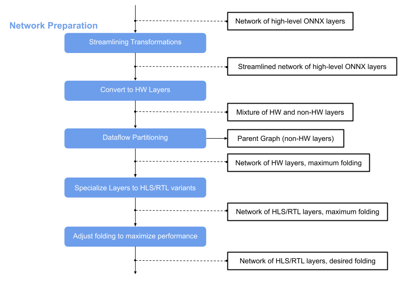

.. _nw_prep:

*******************
Network Preparation
*******************

The main principle of FINN are analysis and transformation passes. If you like to have more information about these please have a look at section :ref:`analysis_pass` and :ref:`transformation_pass` or at chapter :ref:`tutorials` about the provided Jupyter notebooks.

This page is about the network preparation, the flow step that comes after the :ref:`brevitas_export`. Its main idea is to optimize the network and convert the nodes to custom nodes that correspond to `finn-hlslib <https://github.com/Xilinx/finn-hlslib>`_ functions. In this way we get a network that we can bring to hardware with the help of Vivado. For that we have to apply several transformations on the ONNX model, which this flow step receives wrapped in the :ref:`modelwrapper`.

Various transformations are involved in the network preparation. The following is a short overview of these.

Tidy-up transformations
=======================

These transformations do not appear in the diagram above, but are applied in many steps in the FINN flow to postprocess the model after a transformation and/or prepare it for the next transformation. They ensure that all information is set and behave like a "tidy-up". These transformations are the following:

* :py:mod:`qonnx.transformation.general.GiveReadableTensorNames` and :py:mod:`qonnx.transformation.general.GiveUniqueNodeNames`

* :py:mod:`qonnx.transformation.infer_datatypes.InferDataTypes` and :py:mod:`qonnx.transformation.infer_shapes.InferShapes`

* :py:mod:`qonnx.transformation.fold_constants.FoldConstants`

Streamlining Transformations
============================

The idea behind streamlining is to eliminate floating point operations in a model by moving them around, collapsing them into one operation and transforming them into multithresholding nodes. Several transformations are involved in this step. For details have a look at the module :py:mod:`finn.transformation.streamline` and for more information on the theoretical background of this, see `this paper <https://arxiv.org/pdf/1709.04060.pdf>`_.

After this transformation the ONNX model is streamlined and contains now custom nodes in addition to the standard nodes. At this point we can use the :ref:`verification` to simulate the model using Python and in the next step some of the nodes can be converted into HLS layers that correspond to finn_hlslib functions.

Convert to HLS Layers
=====================

Pairs of binary XNORPopcountMatMul layers are converted to StreamingFCLayers and following Multithreshold layers are absorbed into the Matrix-Vector-Activate-Unit (MVAU). The result is a model consisting of a mixture of HLS and non-HLS layers. For more details, see :py:mod:`finn.transformation.fpgadataflow.convert_to_hls_layers`. The MVAU can be implemented in two different modes, *const* and *decoupled*, see chapter :ref:`mem_mode`.

Dataflow Partitioning
=====================

In the next step the graph is split and the part consisting of HLS layers is further processed in the FINN flow. The parent graph containing the non-HLS layers remains. The PE and SIMD are set to 1 by default, so the result is a network of only HLS layers with maximum folding. The model can be verified using the *cppsim* simulation. It is a simulation using C++ and is described in more detail in chapter :ref:`verification`.

Folding
=======

To adjust the folding, the values for PE and SIMD can be increased to achieve also an increase in the performance. The result can be verified using the same simulation flow as for the network with maximum folding (*cppsim* using C++), for details please have a look at chapter :ref:`verification`.

The result is a network of HLS layers with desired folding and it can be passed to :ref:`vivado_synth`.
