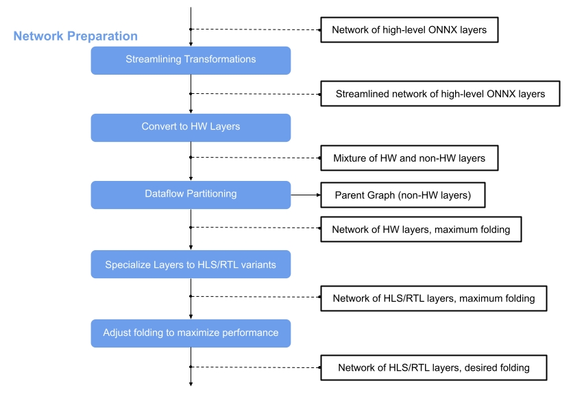

.. _nw_prep:

*******************
Network Preparation
*******************

The main principle of FINN are analysis and transformation passes. For more information about these, see :ref:`analysis_pass` and :ref:`transformation_pass` in the :ref:`concepts` documentation, or the tutorial notebooks in :ref:`tutorials`.

This page describes the network preparation flow step that comes after :ref:`brevitas_export`. The main idea is to optimize the network and convert nodes to hardware layers that correspond to `finn-hlslib <https://github.com/Xilinx/finn-hlslib>`_ or `finn-rtllib <https://github.com/Xilinx/finn-rtllib>`_ implementations. This prepares the network for hardware generation with Vitis HLS and Vivado. Network preparation applies several transformations to the ONNX model, which is wrapped in a :ref:`modelwrapper`.

Various transformations are involved in the network preparation. The following is a short overview of these.

Tidy-up transformations
=======================

These transformations do not appear in the diagram above, but are applied in many steps in the FINN flow to postprocess the model after a transformation and/or prepare it for the next transformation. They ensure that all information is set and behave like a "tidy-up". These transformations are located in the `QONNX repository <https://github.com/fastmachinelearning/qonnx>`_ and can be imported:

* :py:mod:`qonnx.transformation.general.GiveReadableTensorNames` and :py:mod:`qonnx.transformation.general.GiveUniqueNodeNames`

* :py:mod:`qonnx.transformation.infer_datatypes.InferDataTypes` and :py:mod:`qonnx.transformation.infer_shapes.InferShapes`

* :py:mod:`qonnx.transformation.fold_constants.FoldConstants`

Streamlining Transformations
============================

The idea behind streamlining is to eliminate floating point operations in a model by moving them around, collapsing them into one operation and transforming them into multithresholding nodes. Several transformations are involved in this step. For details have a look at the module :py:mod:`finn.transformation.streamline` and for more information on the theoretical background of this, see `this paper <https://arxiv.org/pdf/1709.04060.pdf>`_.

After this transformation the ONNX model is streamlined and contains now custom nodes in addition to the standard nodes. At this point we can use the :ref:`verification` to simulate the model using Python and in the next step some of the nodes can be converted into HLS layers that correspond to finn_hlslib functions.

Convert to HW Layers
=====================

In this step standard or custom layers are converted to HW layers. HW abstraction layers are abstract (placeholder) layers that can be either implemented in HLS or as an RTL module using FINN. These layers are abstraction layers that do not directly correspond to an HLS or Verilog implementation but they will be converted in either one later in the flow.

The result is a model consisting of a mixture of HW and non-HW layers. For more details, see :py:mod:`finn.transformation.fpgadataflow.convert_to_hw_layers`.

Dataflow Partitioning
=====================

In the next step the graph is split and the part consisting of HW layers is further processed in the FINN flow. The parent graph containing the non-HW layers remains.

Specialize Layers
=====================

After converting to HW abstraction layers and excluding non-HW layers, the next step is backend selection. HW abstraction layers are base classes (e.g., ``LayerNorm``, ``MatrixVectorActivation``) that can be implemented in either HLS or RTL.

The ``SpecializeLayers`` transformation converts each base layer to a backend-specific variant (e.g., ``LayerNorm_hls`` or ``LayerNorm_rtl``). This transformation is implemented in :py:mod:`finn.transformation.fpgadataflow.specialize_layers.SpecializeLayers`.

HLS vs RTL Selection
--------------------

The backend selection follows this logic:

1. **Check user preference**: If the ``preferred_impl_style`` node attribute is set to ``"hls"`` or ``"rtl"``, use that backend if available and constraints are satisfied
2. **Apply constraints**: Some RTL implementations have restrictions (e.g., Versal-only, specific datatypes)
3. **Use default**: If no preference is set and RTL is available and constraints are met, RTL is preferred; otherwise HLS is used

**Common RTL constraints:**

- **LayerNorm**: Versal only, FLOAT32 only
- **ElementwiseBinary**: Versal only, FLOAT32 only
- **MVAU**: 2-8 bit signed weights/activations, no embedded threshold
- **VVAU**: Versal only, ≤8 bit signed weights
- **StreamingDataWidthConverter**: Integer width ratio only

Setting Backend Preference
---------------------------

You can set the backend preference per layer using a ``specialize_layers_config.json`` file. The FINN build flow automatically creates a template file after the ``step_create_dataflow_partition`` step at ``<output_dir>/template_specialize_layers_config.json``.

Edit this template to set your preferences:

.. code-block:: json

    {
        "LayerNorm_0": {
            "preferred_impl_style": "rtl"
        },
        "MatrixVectorActivation_1": {
            "preferred_impl_style": "hls"
        }
    }

Then pass this configuration file to the build flow using ``DataflowBuildConfig.specialize_layers_config_file``.

If the preferred backend is not available or constraints are not met, FINN will fall back to the available backend and issue a warning.

For implementation details on adding new HLS or RTL variants, see :doc:`/implementation/specialization-rules`.

Folding
=========

The PE and SIMD are set to 1 by default, so the result is a network of only HLS/RTL layers with maximum folding. The HLS layers of the model can be verified using the *cppsim* simulation. It is a simulation using C++ and is described in more detail in chapter :ref:`verification`.

To adjust the folding, the values for PE and SIMD can be increased to achieve also an increase in the performance. The result can be verified using the same simulation flow as for the network with maximum folding (*cppsim* using C++), for details please have a look at chapter :ref:`verification`.

The result is a network of HLS/RTL layers with desired folding and it can be passed to :ref:`hw_build`.
