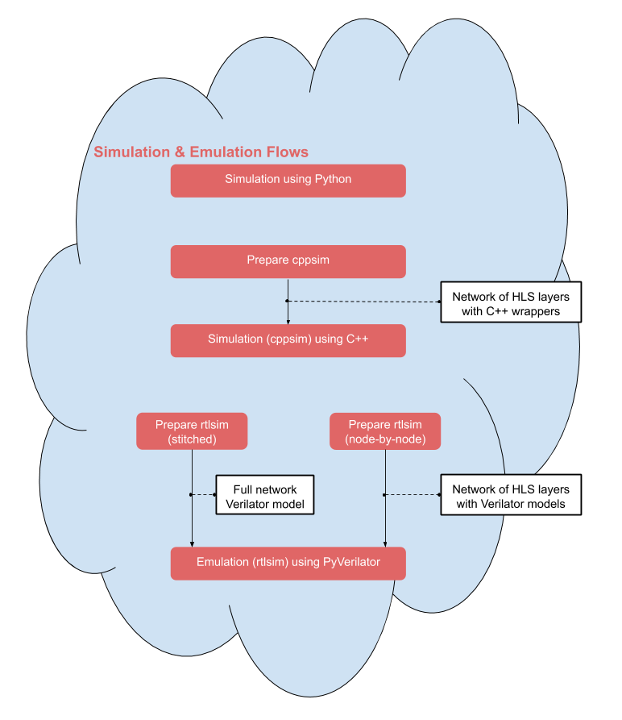

.. _verification:

***********************
Functional Verification
***********************

This part of the flow is covered by the Jupyter notebook about the verification of a simple fully-connected network, which you can find in the `end2end notebook folder <https://github.com/Xilinx/finn/tree/master/notebooks/end2end_example/bnn-pynq/tfc_end2end_verification.ipynb>`_.

When the network is transformed it is important to verify the functionality to make sure the transformation did not change the behaviour of the model. There are multiple ways of verification that can be applied in different stages of the network inside FINN. All can be accessed using the execution function in module :py:mod:`finn.core.onnx_exec`. The execution happens in most cases node by node, which supports networks that have a mixture of standard ONNX nodes, custom nodes and HLS custom nodes. A single node can be executed using one or more of the following methods:

Simulation using Python
=======================

This simulation can be used right after the :ref:`brevitas_export` or when the network does not contain any HLS custom nodes, so right after the streamlining transformations and before the nodes are converted into HLS layers.

Simulation using C++
====================

This simulation can be used for a model containing several HLS custom operations. Because they are based on finn-hlslib function, C++ code can be generated from this single nodes and they can be executed by compiling the code and running the resulting executables.

Emulation using PyVerilator
===========================

The emulation using PyVerilator can be used when IP blocks were generated, either node by node or of a whole (IP-stitched) design. For that purpose PyVerilator gets the generated verilog files.

For debugging purposes, it's possible to generate .vcd trace files that show the value of external & internal signals as the emuation is running. To enable this:
 - for node-by-node rtlsim, set the `rtlsim_trace` attribute of each node of interest to either a file name for the vcd or `default` to use the node name as the filename.
 - for IP-stitched rtlsim, set the `rtlsim_trace` metadata_prop  for the graph as per above.

To control the tracing depth in the module hierarchy, use the `RTLSIM_TRACE_DEPTH` environment variable (default is 1):
 - level 1 shows top-level input/output streams
 - level 2 shows per-layer input/output streams
 - level 3 shows per full-layer I/O including FIFO count signals

Note that deeper tracing will take longer to execute and may produce very large .vcd files.
