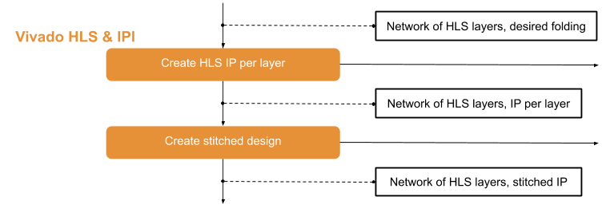

.. _vivado_synth:

*************************
Vivado HLS and Vivado IPI
*************************

In this step the system is handed over to Vivado. To do this, IP blocks are created from each layer using Vivado HLS and then stitched together using Vivado IP Integrator. This creates a Vivado design of the entire network. The design can be verified using `PyVerilator <https://github.com/maltanar/pyverilator>`_ either on the network with the unstitched IP blocks or on the stitched IP. The generated verilog files are passed to PyVerilator and in this way the model can be emulated. This procedure is called *rtlsim* in FINN flow and details can be found in the chapter :ref:`verification`.

Once the model is in the form of a stitched IP, it can be passed to the next flow step :ref:`pynq_deploy`.
