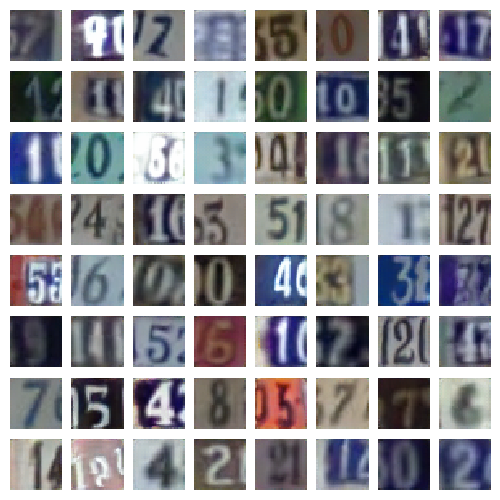
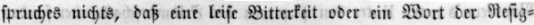
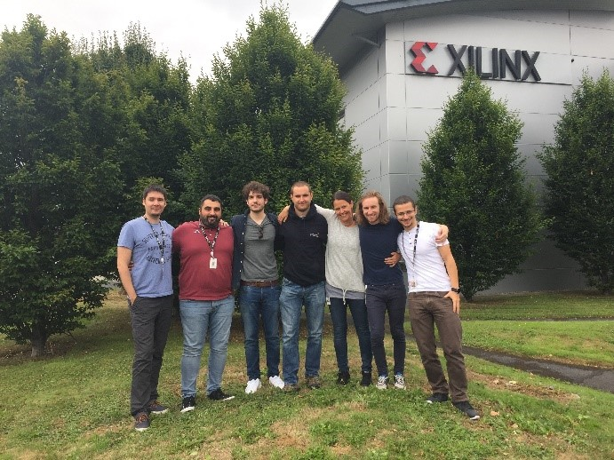

# Machine Learning on Xilinx FPGAs with FINN

## What is FINN?

FINN is an
experimental framework from Xilinx Research Labs to explore deep neural network
inference on FPGAs. 
It specifically targets [quantized neural
networks](https://github.com/maltanar/qnn-inference-examples), with emphasis on
generating dataflow-style architectures customized for each network.
It is not
intended to be a generic DNN accelerator like xDNN, but rather a tool for
exploring the design space of DNN inference accelerators on FPGAs.
 
## Features

* **Templated Vivado HLS library of streaming components:** FINN comes with an
HLS hardware library that implements convolutional, fully-connected, pooling and
LSTM layer types as streaming components. The library uses C++ templates to
support a wide range of precisions.
* **Ultra low-latency and high performance
with dataflow:** By composing streaming components for each layer, FINN can
generate accelerators that can classify images at sub-microsecond latency.
* **Many end-to-end example designs:** We provide examples that start from training a
quantized neural network, all the way down to an accelerated design running on
hardware. The examples span a range of datasets and network topologies.
* **Toolflow for rapid design generation:** The FINN toolflow supports allocating
separate compute resources per layer, either automatically or manually, and
generating the full design for synthesis. This enables rapid exploration of the
design space.

## Quickstart

Depending on what you would like to do, we have
different suggestions on where to get started:

* **I want to try out premade accelerators on real hardware.** Head over to [BNN-
PYNQ](https://github.com/Xilinx/BNN-PYNQ) repository to try out some image
classification accelerators, or to [LSTM-PYNQ](https://github.com/Xilinx/LSTM-PYNQ) 
to try optical character recognition with LSTMs.
* **I want to try the full design flow.** The [FINN](https://github.com/Xilinx/FINN) repository
contains the Python toolflow that goes from a trained, quantized Caffe network
to an accelerator running on real hardware.
* **I want to train new quantized networks for FINN.** Have a look [here](https://github.com/Xilinx/BNN-PYNQ/tree/master/bnn/src/training), at 
[this presentation](https://drive.google.com/open?id=17oorGvtUbdFd-o1OzSuxGCSrWsvm_S2ftC1UC2FLtuE) 
for an example with Fashion-MNIST, or [here](https://github.com/Xilinx/pytorch-ocr) for quantized 
LSTMs with PyTorch.
* **I want to understand how it all fits together.** Check out our [publications](#publications), 
particularly the [FINN paper at FPGA'17](https://arxiv.org/abs/1612.07119) and the [FINN-R paper in ACM TRETS](https://arxiv.org/abs/1809.04570).

## Neural Network Demos

Multiple Jupyter notebooks examples are provided, with different datasets and two architectures:

* **Feed-forward Dataflow**: all layers of the network are
implemented in the hardware, the output of one layer is the input of the
following one that starts processing as soon as data is available. The network
parameters for all layers are cached in the on-chip memory. For each network
topology, a customized hardware implementation is generated that provides low
latency and high throughput.

* **Dataflow with loopback**: a fixed hardware
architecture is implemented, being able to compute multiple layers in a single
call. The complete network is executed in multiple calls, which are scheduled on
the same hardware architecture. Changing the network topology implies changing
the runtime scheduling, but not the hardware architecture. This provides a
flexible implementation but features slightly higher latency.

Our design
examples are mostly for the [PYNQ](http://www.pynq.io/) Z1 and Z2 boards, and a
few for the Ultra96. Future support for AWS F1 and other Xilinx platforms is
also planned.

### Demos with Dataflow Architecture 

| Thumbnail | Dataset | Neural Network | Task | Link |
|-----------|---------|-------------|------|--------|
||<a href="https://www.cs.toronto.edu/~kriz/cifar.html" target="_blank">CIFAR-10</a>|6 convolutional, 3 max pool and 3 fully connected layers|Image classification (animals and vehicles)|[Cifar10](https://github.com/Xilinx/BNN-PYNQ/blob/master/notebooks/CNV-BNN_Cifar10.ipynb)|
||<a href="http://ufldl.stanford.edu/housenumbers/" target="_blank">Street View House Numbers</a>|6 convolutional, 3 max pool and 3 fully connected layers|Image classification (house numbers)|[SVHN](https://github.com/Xilinx/BNN-PYNQ/blob/master/notebooks/CNV-BNN_SVHN.ipynb)|
||<a href="http://benchmark.ini.rub.de/?section=gtsdb&subsection=dataset" target="_blank">German Road Signs</a>|6 convolutional, 3 max pool and 3 fully connected layers|Image classification (road signs)|[GTRSB](https://github.com/Xilinx/BNN-PYNQ/blob/master/notebooks/CNV-BNN_Road-Signs.ipynb)|
||<a href="http://yann.lecun.com/exdb/mnist/" target="_blank">MNIST</a>|3 fully connected layers|Image classification (handwritten digits)|[MNIST](https://github.com/Xilinx/BNN-PYNQ/blob/master/notebooks/LFC-BNN_MNIST_Webcam.ipynb)|
||Fraktur|Bi-LSTM|Optical Character Recognition|[Fraktur](https://github.com/Xilinx/LSTM-PYNQ/blob/master/notebooks/Fraktur_OCR.ipynb)|

### Demos with Loopback Architecture

* [ImageNet Classification](https://github.com/Xilinx/QNN-MO-PYNQ/blob/master/notebooks/dorefanet-classification.ipynb): shows an example
on how to classify a non-labelled image (e.g., downloaded from the web, your
phone etc) in one of the 1000 classes available on the <a href="http://image-
net.org/challenges/LSVRC/2014/browse-synsets" target="_blank"> ImageNet </a>
dataset.  

* [ImageNet - Dataset validation](https://github.com/Xilinx/QNN-MO-PYNQ/blob/master/notebooks/dorefanet-imagenet-samples.ipynb): shows an example classifying labelled image (i.e.,  extracted
from the dataset) in one of the 1000 classes available on the <a href="http
://image-net.org/challenges/LSVRC/2014/browse-synsets" target="_blank"> ImageNet
</a> dataset.  

* [ImageNet - Dataset validation in a loop](https://github.com/Xilinx/QNN-MO-PYNQ/blob/master/notebooks/dorefanet-imagenet-loop.ipynb): shows an example classifying labelled image
(i.e.,  extracted from the dataset) in one of the 1000 classes available on the
<a href="http://image-net.org/challenges/LSVRC/2014/browse-synsets"
target="_blank"> ImageNet </a> dataset in a loop.

* [Object Detection - from image](https://github.com/Xilinx/QNN-MO-PYNQ/blob/master/notebooks/tiny-yolo-image.ipynb): shows object detection in a image
(e.g., downloaded from the web, your phone etc), being able to identify objects
in a scene and drawing bounding boxes around them. The objects can be one of the
20 available in the  <a href="http://host.robots.ox.ac.uk/pascal/VOC/"
target="_blank"> PASCAL VOC </a> dataset

## Other Repositories

* The [FINN toolflow repository](https://github.com/Xilinx/FINN) contains a end-to-end Python
"compiler" flow to import a trained [quantized
Caffe](https://github.com/zhaoweicai/hwgq/) network, perform simplifications and
resource allocation per layer, emit and synthesize the resulting HLS design.

* The [pytorch-quantization repository](https://github.com/Xilinx/pytorch-quantization) provides primitives for **LSTM** quantization at training time
using **PyTorch**.

* The [pytorch-ocr repository](https://github.com/Xilinx/pytorch-ocr) provides tools for training and exporting quantized LSTMs for
**OCR** in PyTorch, targeting **LSTM-PYNQ**.

## Publications

* FPL'18: [FINN-L:
Library Extensions and Design Trade-off Analysis for Variable Precision LSTM
Networks on FPGAs](https://arxiv.org/pdf/1807.04093.pdf)
* FPL'18: [BISMO: A
Scalable Bit-Serial Matrix Multiplication Overlay for Reconfigurable
Computing](https://arxiv.org/pdf/1806.08862.pdf)
* FPL'18: [Customizing Low-
Precision Deep Neural Networks For
FPGAs](http://kalman.mee.tcd.ie/fpl2018/content/pdfs/FPL2018-43iDzVTplcpussvbfIaaHz/XZmyRhWvHACdwHRVTCTVB/6jfImwD836ibhOELmms0Ut.pdf)
* ACM TRETS, Special Issue on Deep Learning: [FINN-R: An End-to-End Deep-
Learning Framework for Fast Exploration of Quantized Neural
Networks](https://arxiv.org/abs/1809.04570)
* ARC'18: [Accuracy to Throughput
Trade-Offs for Reduced Precision Neural Networks on Reconfigurable
Logic](https://arxiv.org/pdf/1807.10577.pdf)
* CVPR’18: [SYQ: Learning Symmetric
Quantization For Efficient Deep Neural
Networks](https://arxiv.org/abs/1807.00301)
* DATE'18: [Inference of quantized
neural networks on heterogeneous all-programmable
devices](https://ieeexplore.ieee.org/abstract/document/8342121/)
* ICONIP’17:
[Compressing Low Precision Deep Neural Networks Using Sparsity-Induced
Regularization in Ternary Networks](https://arxiv.org/abs/1709.06262)
* ICCD'17:
[Scaling Neural Network Performance through Customized Hardware Architectures on
Reconfigurable Logic](https://ieeexplore.ieee.org/abstract/document/8119246/)
* PARMA-DITAM'17: [Scaling Binarized Neural Networks on Reconfigurable
Logic](https://arxiv.org/abs/1701.03400)
* FPGA'17: [FINN: A Framework for Fast,
Scalable Binarized Neural Network Inference](https://arxiv.org/abs/1612.07119)
* H2RC'16: [A C++ Library for Rapid Exploration of Binary Neural Networks on
Reconfigurable Logic](https://h2rc.cse.sc.edu/2016/papers/paper_25.pdf)

## External Publications and Projects Based on FINN

If you are using FINN in your
work and would like to be listed here, please contact us!

* [BinaryEye: A 20 kfps Streaming Camera System on FPGA with Real-Time On-Device Image Recognition Using Binary Neural Networks](https://ieeexplore.ieee.org/abstract/document/8442108)
* [Cucumber sorting with FINN (in Japanese)](https://qiita.com/ykshr/items/08147098516a45203761)
* [ReBNet: Residual Binarized Neural Network, FCCM'18 best paper](https://github.com/mohaghasemzadeh/ReBNet)

## Events, Tutorials and Keynotes

* BigData Belfast'2018 talk: [Unconventional Compute Architectures for Enabling the Roll-Out of Deep Learning](https://github.com/Xilinx/FINN/blob/master/docs/BigDataBelfast2018.pdf)
* CLUSTER'2018 keynote: [Unconventional Compute Architectures with Reconfigurable Devices in the Cloud](https://github.com/Xilinx/FINN/blob/master/docs/IEEECluster2018.pdf)
* RCML'2018 invited talk: [The Emerging Computational Landscape of Neural Networks](https://github.com/Xilinx/FINN/blob/master/docs/ARC2018.pdf)
* HotChips'2018 ML tutorial: [Overview of Deep Learning and Computer Architectures for Accelerating DNNs](https://github.com/Xilinx/FINN/blob/master/docs/Hotchips2018_Tutorial.pdf)
  + [Video](https://youtu.be/ydsZ7A0FF0I)
* ASAP'2018 keynote: [Design Trade-offs for Machine Learning Solutions on Reconfigurable Devices](https://github.com/Xilinx/FINN/blob/master/docs/ASAP2018.pdf)
* ARC'2018 keynote: [Scalable Machine Learning with Reconfigurable Devices](https://github.com/Xilinx/FINN/blob/master/docs/ARC2018.pdf)
* FPGA'2018 tutorial: [Training Quantized Neural Networks](https://github.com/Xilinx/FINN/blob/master/docs/FPGA2018_tutorial.pdf)
* MPSoC 2017 talk: [A Framework for Reduced Precision Neural Networks on FPGAs](https://github.com/Xilinx/FINN/blob/master/docs/MPSOC2018.pdf)
* TCD 2017 guest lecture on ML: [Machine Learning for Embedded Systems (Video)](https://www.youtube.com/watch?v=pIVh-4tqjPc)
* QPYNQ'2017 tutorial: [Quantized Neural Networks with Xilinx PYNQ](https://www.ntnu.edu/ie/eecs/qpynq)

## People

### The FINN Team

We are part of Xilinx's CTO group under Ivo Bolsens (CTO) and Kees Vissers (Fellow) and working very closely with the Pynq team and Kristof Denolf and Jack Lo for integration with video processing.

From left to right: Lucian Petrica, Giulio Gambardella,
Alessandro Pappalardo, Ken O’Brien, Michaela Blott, Nick Fraser, Yaman Umuroglu

### External Collaborators
* NTNU, Norway: Magnus Jahre, Magnus Sjalander
* University of Sydney, Australia: Julian Faraone, Philip Leong
* ETH Zurich, Switzerland: Kaan Kara, Ce Zhang, Lois Orosa, Onur Mutlu
* University of Kaiserslautern, Germany: Vladimir Rybalkin, Mohsin Ghaffar, Nobert Wehn
* Imperial College, UK: Alex (Jiang) Su and Peter Cheung
* Northeastern University, USA: Miriam Leeser
* Trinity College Dublin, Ireland: Linda Doyle
* Missing Link Electronics, Germany
