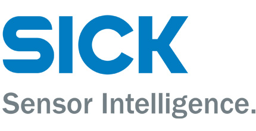

# FINN

FINN is a machine learning framework by the Integrated Communications and AI Lab of AMD Research & Advanced Development.
It provides an end-to-end flow for the exploration and implementation of quantized neural network inference solutions on FPGAs.
FINN generates dataflow architectures as a physical representation of the implemented custom network in space.
It is not a generic DNN acceleration solution but relies on co-design and design space exploration for quantization and parallelization tuning so as to optimize a solutions with respect to resource and performance requirements.
 
The FINN compiler is under active development <a href="https://github.com/Xilinx/finn">on GitHub</a>, and we welcome contributions from the community!

## Features

* **Templated Vitis HLS and RTL library of streaming components:** FINN comes with a
library of HLS and RTL modules that implement neural network layers as streaming components.
* **Ultra low-latency and high performance
with dataflow:** By composing streaming components for each layer, FINN can
generate accelerators that can classify images at sub-microsecond latency.
* **Many end-to-end example designs:** We provide examples that start from training a
quantized neural network, all the way down to an accelerated design running on
hardware. The examples span a range of datasets and network topologies.
* **Toolflow for rapid design generation:** The FINN toolflow supports allocating
separate compute resources per layer, either automatically or manually, and
generating the full design for synthesis. This enables rapid exploration of the
design space.

## Customer Testimonials

 
*“The FINN toolset is showing huge potential using it in upcoming SICK products.
It is easy to use and with an extraordinary performance and very promising results. 
In the future, flexible implementations of ML in our products with FINN can be a great advantage and even replace static architectures as they are currently used.
Thanks to the FINN team for the great cooperation.”*

