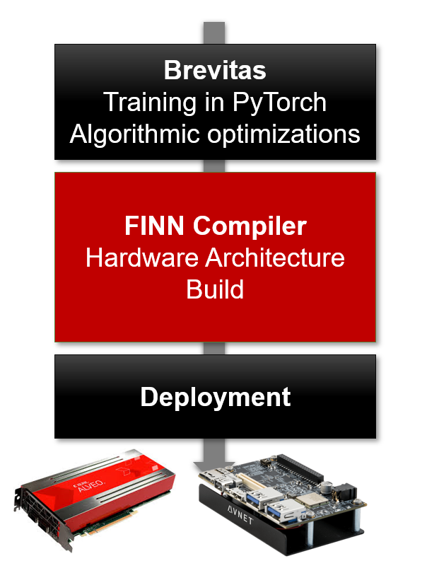

## Quickstart

### Repo links
Depending on what you would like to do, we have different suggestions on where to get started:

* **I want to try out prebuilt QNN accelerators on my FPGA board.** Head over to [finn-examples](https://github.com/Xilinx/finn-examples)
to try out some FPGA accelerators built with the FINN compiler.
* **I want to train new quantized networks for FINN.** Check out <a href="https://github.com/Xilinx/brevitas">Brevitas</a>,
our PyTorch library for quantization-aware training.
* **I want to work with the FPGA building blocks for neural networks directly** Check out the [HLS](https://github.com/Xilinx/finn-hlslib) and [RTL](https://github.com/Xilinx/finn/tree/main/finn-rtllib) library of FINN.
* **I want to understand how it all fits together.** Check out the <a href="https://github.com/Xilinx/finn">FINN compiler</a>.

### Introduction videos & articles
* [Video tutorial @FPGA 2021](https://www.youtube.com/watch?v=zw2aG4PhzmA)
* [FINN paper](https://arxiv.org/pdf/1612.07119.pdf)
* [FINN-R paper](https://arxiv.org/pdf/1809.04570.pdf) - this is what the current tool-flow is mostly based on
* Brevitas tutorial @TVMCon2021: [Video](https://www.youtube.com/watch?v=wsXx3Hr5kZs) and [Jupyter notebook](https://github.com/Xilinx/brevitas/blob/master/notebooks/Brevitas_TVMCon2021.ipynb)

### More in depth material
* [FINN documentation](https://finn.readthedocs.io/en/latest/)
* [Brevitas documentation](https://xilinx.github.io/brevitas/)
* [FINN installation instructions](https://finn.readthedocs.io/en/latest/getting_started.html)
* [Full stack tutorial for training an MLP with Brevitas + deploying with FINN](https://github.com/Xilinx/finn/tree/main/notebooks/end2end_example/cybersecurity)
* [Tutorial showing detailed compilation steps for a trained fully-connected network](https://github.com/Xilinx/finn/blob/main/notebooks/end2end_example/bnn-pynq/tfc_end2end_example.ipynb)
* [Building on the pervious tutorial, a tutorial showing detailed verification steps for a trained fully-connected network](https://github.com/Xilinx/finn/blob/main/notebooks/end2end_example/bnn-pynq/tfc_end2end_verification.ipynb) 
* 2-part demonstrator as shown on youtube: [Part 1 - Toolflow](https://www.youtube.com/watch?v=z49tzp3CBoM) & [Part 2 - Hardware Performance Demo](https://www.youtube.com/watch?v=W35c5XmnlhA)
