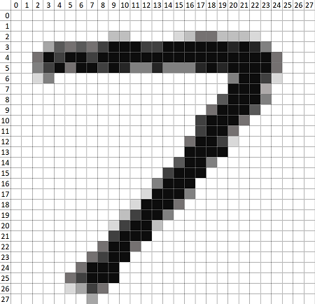

# FINN Example FPGA Flow Using MNIST Numerals

This example demonstrates how to bring a FINN compiled model into the Vivado FPGA design environment for integration into a larger FPGA application. It extends on the command-line [build_dataflow](https://github.com/Xilinx/finn/tree/master/src/finn/qnn-data/build_dataflow) using a model that was quantized with [Brevitas](https://github.com/Xilinx/brevitas) down to single-bit weight/ativation precision to classify hand-written numerals from the MNIST data set. 

If you are new to the command-line flow, more information can be found [here](https://finn.readthedocs.io/en/latest/command_line.html).

This demo was created using Vivado 2020.1.  

## Compiling the Model in FINN

#### Configuration
`build.py` assembles the needed files and configures how the model is compiled when generating the "stitched IP".  The following items will need to be set appropriately for specific use cases:
- `output_dir`: defines the directory to be created for FINN compiler output.
- `target_fps`: desired throughput performance target for FINN compiler to achieve.
- `mvau_wwidth_max`:  _an optional parameter_ ([described here](https://finn.readthedocs.io/en/latest/source_code/finn.builder.html#finn.builder.build_dataflow_config.DataflowBuildConfig.mvau_wwidth_max)) shown only to illustrate passing additional configuration items to the compiler.
- `folding_config_file`: an optional parameter to pass a json file defining the layer optimizations (PE,SIMD,ramstyle, etc.) to the compiler.
- `synth_clk_period_ns`: set the desired clock period in nS.
- `fpga_part` configures the IP for your target device that the stitched IP will be implemented in.  It should be the full string recognized in Vivado: \<device\>-\<package\>-\<temperature_grade\>-\<speed_grade\>
- `generate_outputs`: for integration purposes, the only output needed is `...STITCHED_IP`.  You might also find the `ESTIMATE_REPORTS` interesting.  Other options are documented [here](https://finn.readthedocs.io/en/latest/command_line.html#generated-outputs) and some of them (namely OOC_SYNTH, BITFILE) add substantial runtime and are not needed for this flow.


### Running FINN Compiler

Prior to running, insure the following prerequisites have been met:
- Install FINN.  This script may be helpful:
  ([`Xilinx/finn-examples/build/get_finn.sh`](https://github.com/Xilinx/finn-examples/blob/main/build/get-finn.sh))
- Insure you have `VIVADO_PATH` env variable set appropriately for your install.  For example:
> export VIVADO_PATH=/opt/Xilinx/Vivado/2020.1
- For convenience, set env variable for your `finn` install top directory:
> export FT_PATH=/home/foo/finn/

Then, change to `finn` install directory and invoke:
> cd ${FT_PATH}  
> ./run-docker.sh build_custom ${FT_PATH}/tutorials/fpga_flow/

The build should finish in about 10 minutes, and the FINN docker will close on success.

```
   ...
   Running step: step_create_stitched_ip [11/16]
   Running step: step_measure_rtlsim_performance [12/16]
   Running step: step_out_of_context_synthesis [13/16]
   Running step: step_synthesize_bitfile [14/16]
   Running step: step_make_pynq_driver [15/16]
   Running step: step_deployment_package [16/16]
   Completed successfully
   The program finished and will be restarted
```


### Examine the Stitched IP

Navigate to the stitched IP project directory:

> cd ${FT_PATH}/tutorials/fpga_flow/output_tfc_w0a1_fpga/stitched_ip

And, open the project:

> vivado finn_vivado_stitch_proj.xpr

Explore the IPI board design and note the interfaces.  


### Simulating the Stitched IP with a Verilog Test Bench

The included `testbench.sv` is a very simple test to illustrate how to feed data to the compiled model. 

The image data is 784 bytes per frame, organized as 28x28 unsigned integer bytes.  However, due to the folding optimizations chosen, the input data is transfered to the hardware model 49 bytes at a time over 16 cycles.  Note how this matches PE=49 as selected for the first layer in `folding_config.json` 

Using the following image for coordinate reference where a byte is identified as B\<row\>\_\<column\> we see that B0_0 is the upper leftmost byte, and B27_27 is the lower right most byte:



Thus, the input data for the first cycle is organized as such:
```
  s_axis_0_tdata[391:0] = {B1_20,B1_19, ...  ,B1_0,B0_27, ...  ,B0_1,B0_0};
```

The testbench reads data from a simple text file (data.hex).  The included script `gen_tb_data.py` creates the test data as well as the ground truth expectations (Note: using ground truth is undesirable if the intent is to validate that the HW implementation matches the trained model).  The script takes the liberty of flipping the byte-order such that verilog's `$readmemh` brings B0_0 nicely into the LSB position.   To generate the test data:

> cd ${FT_PATH}/tutorials/fpga_flow/output_tfc_w0a1_fpga/stitched_ip  
> mkdir -p finn_vivado_stitch_proj.sim/sim_1/behav/xsim  
> ../../gen_tb_data.py > finn_vivado_stitch_proj.sim/sim_1/behav/xsim/data.hex

In Vivado, add the testbench as a simulation file by pasting the following into the Tcl Console:
> add_files -fileset sim_1 -norecurse ../../testbench.sv


Then, run the simulation (Flow Navigator -> Simulation -> Run Simulation).   Give the simulator a `run -all`  (click the "play" button in the simulator) to run the sim to its $finish conclusion.  With 20 test points run, it should have 1 mismatch due using the ground-truth as the check source:

```
 ************************************************************ 
  SIM COMPLETE
   Validated 20 data points 
   Total error count: ====>  1  <====
```

#### Instantiation in Mission Design

There are any number of ways to bring the stitched IP into larger design.  

You may want to package the stitched IP BD (or entire project) as its own IP.  A good reference for this is [UG1119](https://www.xilinx.com/support/documentation/sw_manuals/xilinx2020_1/ug1119-vivado-creating-packaging-ip-tutorial.pdf)  

Keep in mind that all of the User IP Repo's included in the Stitched IP project (from /tmp) need to also be brought in as IP Repo's to any project using the stitched IP.  It would be prudent to copy those IP repos to an appropriate archive location.

